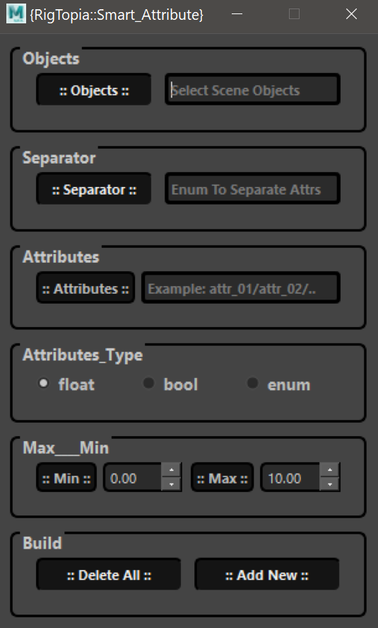

# Smart Attribute Manager
A compact script designed to simplify and streamline daily repetitive tasks of adding or removing attributes 
in Autodesk Maya, making the workflow more efficient and user-friendly.


# Features
Intuitive UI for adding or removing attributes.
Quick setup and usage.
Reduces repetitive work, saving time and effort.

Add as many attrs as you want for any number of objects 
modify the attribute type if you want at any time.

organize each section of attrs by the separator attribute 
or use it as Enum attribute with strings as you want.
  

## UI Template


## Demo 
https://youtu.be/LSRvlhCwYZM

## Installation
Download and place the folder Copy the crv_attrs folder into:
C:\Users\<username>\Documents\maya\scripts

 Run the script in Maya Script Editor:

```python
from crv_attrs.crv_attrs_ui import SmartAttributeUI
try:
    global main
    main.close()
    main.deleteLater()

except:
    pass
main = SmartAttributeUI()
main.show()
```
## How to Use
After executing the script, the Smart Attribute Manager UI will appear in Maya.
Use the UI to easily add or remove attributes for selected objects.
Enjoy a faster and more intuitive workflow!

## Compatibility
Software: Autodesk Maya

## Version: Compatible with Maya 2022 and above.

## Contribution
Feel free to contribute or report issues!

## License
This project is licensed under the MIT License - see the LICENSE file for details.

Optimize your Maya workflow with the Smart Attribute Manager today!
